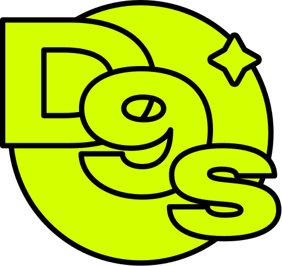

D9s manages application deployments across multiple environments and cloud providers using pluggable adapters.

## Features

- **Multi-application management** - Manage multiple apps and versions across different environments
- **Adapter-based deployments** - Pluggable support for AWS, Kubernetes, Hetzner, DigitalOcean, etc.
- **Flexible deployment models** - Deploy to one server, a group of servers, or orchestrated environments
- **Real-time monitoring** - Track deployment status, server health, and rollbacks
- **Stupid simple** - D9s runs on single Linux box without complicated database setup.

## Project Status

**Early development** - MVP targeting AWS ASG + Kamal adapter.

Current focus:

- ✅ core data models
- ⏳ context modules
- ⏳ first deployment adapter
- ⏳ JSON API
- ⏳ basic web interface

## Documentation

- [Development Roadmap](docs/roadmap.md) - Strategic vision, goals, planned features
- [Architecture Decision Records](docs/adr/0-architecture-decision-records.md) - Technical design decisions

## Development

**Setup:**
```bash
mix setup
mix phx.server
# Visit localhost:4000
```

**Testing and docs:**
```bash
# Run tests
mix test

# Generate docs
mix docs
```

**Tech stack:** Ecto, Oban, SQLite+Litestream, Phoenix LiveView, Tailwind

## Contributing

Humans and AIs, attention!

1. Read this README.md completely
2. Review [Development Roadmap](docs/roadmap.md) for strategic context
3. Study architecture decision records within `docs/adr/` directory
4. Propose new features/changes as ADRs first
5. Wait for ADR approval before implementing

**No direct implementation without documented decisions.**
